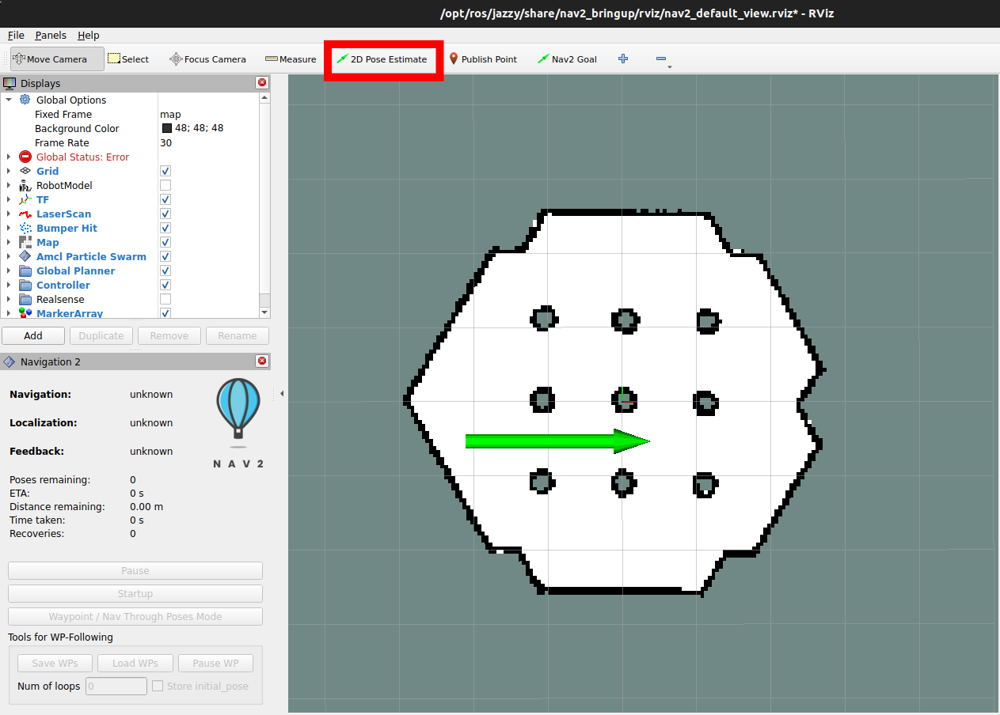
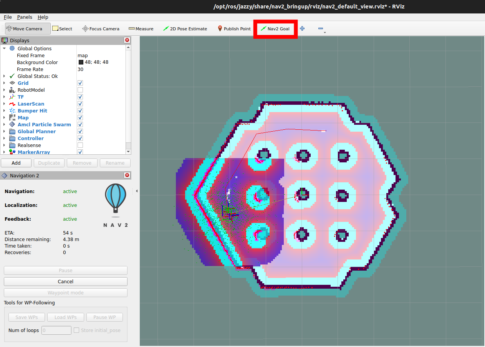

# Projekt-Miapr

Implementation of the RRG planner with `nav2` in ROS 2 Jazzy, integrated with a TurtleBot simulation.

---

## 🚀 Getting Started

### 1. Clone the Repository

```bash
git clone https://github.com/yourusername/Projekt-Miapr.git
cd Projekt-Miapr
```

### 2. Configure `WORKSPACE_PATH`

Edit the `WORKSPACE_PATH` variable in the `start.sh` script to point to the directory where you cloned the repository:

```bash
WORKSPACE_PATH="/home/bartek/Desktop/projekty/miapr/Projekt-Miapr"
```

> 💡 Replace the above path with the full path to your local clone of the repo.

### 3. Build & Run Docker Container

Make sure `start.sh` has execute permission:

```bash
chmod +x start.sh
```

Then run the script:

```bash
./start.sh
```

This will build and launch the Docker container with the necessary ROS 2 environment.

---

## 🧭 Running the Planner

Once inside the container:

### 1. Build the ROS 2 Workspace

```bash
source /opt/ros/jazyy/setup.bash
colcon build
source install/setup.bash
```

### 2. Start the Simulation

Ensure `start_simulation.sh` is executable:

```bash
chmod +x start_simulation.sh
./start_simulation.sh
```

---

## 🖥️ RViz Setup

1. In RViz, use the **2D Pose Estimate** tool to roughly set the initial pose of the robot:  
   

2. Then, send a navigation goal using the **Nav2 Goal** tool:  
   

---
